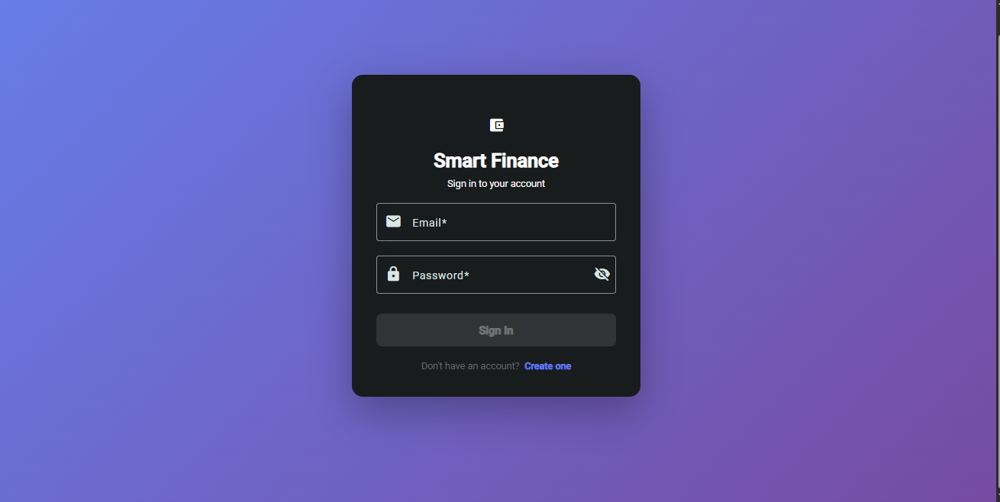
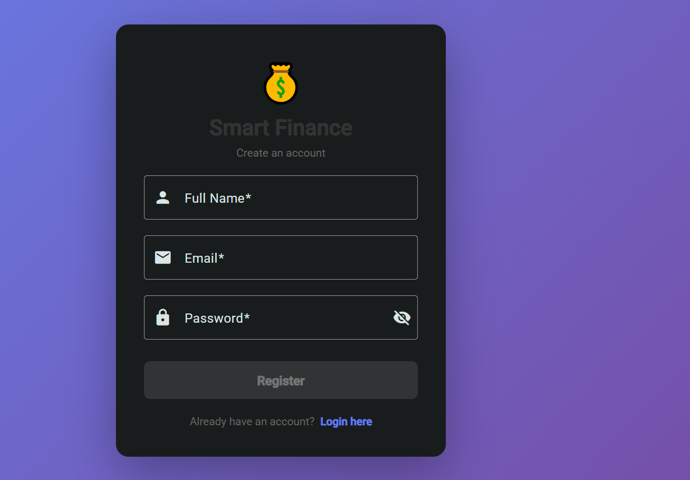

# 💰 Smart Finance — AI-Powered Personal Finance Dashboard


> A full-stack, AI-powered personal finance management application built with Angular, Spring Boot, and PostgreSQL.(Still building it) Track your income, expenses, and budgets — and let AI surface smart insights about your spending habits.

---

## 📸 Screenshots


> _Coming soon — dashboard, transactions page, and AI insights view_

---

## ✨ Features

- 🔐 **JWT Authentication** — Secure registration and login with Spring Security
- 💳 **Transaction Management** — Add, edit, delete, and categorize income & expenses
- 📊 **Interactive Dashboard** — Real-time charts (bar, line, pie) powered by Chart.js
- 🎯 **Budget Tracking** — Set monthly budgets per category with live progress indicators
- 🤖 **AI-Powered Insights** — Smart spending analysis and personalized financial tips
- 📁 **Export Reports** — Download transactions as CSV or PDF
- 🐳 **Dockerized** — Fully containerized with Docker Compose
- 🔄 **CI/CD Pipeline** — Automated testing and builds via GitHub Actions

---

## 🏗️ Architecture

```
┌─────────────────┐        ┌──────────────────────┐        ┌─────────────────┐
│                 │        │                      │        │                 │
│  Angular 17+    │◄──────►│  Spring Boot 3 API   │◄──────►│  PostgreSQL 15  │
│  (Frontend)     │  REST  │  (Backend)           │  JPA   │  (Database)     │
│                 │  /JWT  │                      │        │                 │
└─────────────────┘        └──────────────────────┘        └─────────────────┘
                                      │
                                      ▼
                            ┌──────────────────┐
                            │   OpenAI API     │
                            │  (AI Insights)   │
                            └──────────────────┘
```

---

## 🛠️ Tech Stack

| Layer | Technology |
|---|---|
| **Frontend** | Angular 17+, TypeScript, Chart.js, Angular Material |
| **Backend** | Spring Boot 3, Spring Security, JWT, JPA/Hibernate |
| **Database** | PostgreSQL 15, Flyway (migrations) |
| **AI** | OpenAI API / Rule-based insight engine |
| **DevOps** | Docker, Docker Compose, GitHub Actions |
| **Testing** | JUnit 5 (backend), Jasmine/Karma (frontend) |

---

## 🗄️ Database Schema

```sql
-- Users
CREATE TABLE users (
    id UUID PRIMARY KEY DEFAULT gen_random_uuid(),
    email VARCHAR(255) UNIQUE NOT NULL,
    password VARCHAR(255) NOT NULL,
    role VARCHAR(50) DEFAULT 'USER',
    created_at TIMESTAMP DEFAULT NOW()
);

-- Categories
CREATE TABLE categories (
    id UUID PRIMARY KEY DEFAULT gen_random_uuid(),
    name VARCHAR(100) NOT NULL,
    type VARCHAR(20) NOT NULL, -- INCOME | EXPENSE
    user_id UUID REFERENCES users(id)
);

-- Transactions
CREATE TABLE transactions (
    id UUID PRIMARY KEY DEFAULT gen_random_uuid(),
    amount DECIMAL(10,2) NOT NULL,
    description TEXT,
    date DATE NOT NULL,
    category_id UUID REFERENCES categories(id),
    user_id UUID REFERENCES users(id),
    created_at TIMESTAMP DEFAULT NOW()
);

-- Budgets
CREATE TABLE budgets (
    id UUID PRIMARY KEY DEFAULT gen_random_uuid(),
    category_id UUID REFERENCES categories(id),
    user_id UUID REFERENCES users(id),
    amount DECIMAL(10,2) NOT NULL,
    month INT NOT NULL,
    year INT NOT NULL
);

-- AI Insights
CREATE TABLE insights (
    id UUID PRIMARY KEY DEFAULT gen_random_uuid(),
    user_id UUID REFERENCES users(id),
    message TEXT NOT NULL,
    generated_at TIMESTAMP DEFAULT NOW()
);
```

---

## 📁 Project Structure

```
smart-finance/
├── backend/                        # Spring Boot application
│   ├── src/main/java/
│   │   └── com/smartfinance/
│   │       ├── controller/         # REST controllers
│   │       ├── service/            # Business logic
│   │       ├── repository/         # JPA repositories
│   │       ├── model/              # Entity classes
│   │       ├── dto/                # Request/Response DTOs
│   │       ├── security/           # JWT & Spring Security config
│   │       └── config/             # App configuration
│   ├── src/main/resources/
│   │   ├── application.yml
│   │   └── db/migration/           # Flyway SQL scripts
│   └── Dockerfile
│
├── frontend/                       # Angular application
│   ├── src/app/
│   │   ├── auth/                   # Login & Register
│   │   ├── dashboard/              # Main dashboard + charts
│   │   ├── transactions/           # Transaction CRUD
│   │   ├── budgets/                # Budget management
│   │   ├── insights/               # AI insights page
│   │   └── shared/                 # Components, guards, pipes
│   └── Dockerfile
│
├── docker-compose.yml
├── .github/
│   └── workflows/
│       └── build.yml               # GitHub Actions CI/CD
└── README.md
```

---

## 🚀 Getting Started

### Prerequisites

Make sure you have the following installed:
- [Docker](https://www.docker.com/) & Docker Compose
- [Node.js](https://nodejs.org/) 18+ & npm
- [Java](https://adoptium.net/) 17+
- [Maven](https://maven.apache.org/) 3.8+

### Run with Docker (Recommended)

```bash
# 1. Clone the repository
git clone https://github.com/YOUR_USERNAME/smart-finance.git
cd smart-finance

# 2. Start all services
docker-compose up --build

# 3. Access the app
# Frontend  → http://localhost:4200
# Backend API → http://localhost:8080
# Swagger UI  → http://localhost:8080/swagger-ui.html
```

### Run Locally (Without Docker)

```bash
# --- Backend ---
cd backend
cp src/main/resources/application.example.yml src/main/resources/application.yml
# Edit application.yml with your PostgreSQL credentials
mvn spring-boot:run

# --- Frontend ---
cd frontend
npm install
ng serve
```

---

## 🔌 API Endpoints

| Method | Endpoint | Description | Auth |
|---|---|---|---|
| POST | `/api/auth/register` | Register a new user | 
| POST | `/api/auth/login` | Login & get JWT token |
| GET | `/api/transactions` | Get all transactions |
| POST | `/api/transactions` | Create a transaction | 
| PUT | `/api/transactions/{id}` | Update a transaction | 
| DELETE | `/api/transactions/{id}` | Delete a transaction | 
| GET | `/api/budgets` | Get all budgets | 
| POST | `/api/budgets` | Create a budget | 
| GET | `/api/insights` | Get AI insights | 
| GET | `/api/dashboard/summary` | Get dashboard stats | 

> Full API documentation available at `/swagger-ui.html` when running locally.

---

## 🔄 CI/CD Pipeline

```yaml
# GitHub Actions — runs on every push to main
✔ Checkout code
✔ Run backend unit tests (JUnit 5)
✔ Run frontend tests (Karma)
✔ Build Docker images
✔ Push to Docker Hub
```

---

## 📅 Roadmap

- [x] Project setup & Docker configuration
- [x] JWT Authentication (register/login)
- [x] Transaction CRUD API
- [ ] Angular dashboard with charts
- [ ] Budget management
- [ ] AI-powered insights
- [ ] CSV/PDF export
- [ ] CI/CD pipeline
- [ ] Deploy to cloud (Railway + Vercel)

---

## 🤝 Contributing

Contributions, issues and feature requests are welcome!

1. Fork the project
2. Create your feature branch (`git checkout -b feature/my-feature`)
3. Commit your changes (`git commit -m 'Add my feature'`)
4. Push to the branch (`git push origin feature/my-feature`)
5. Open a Pull Request

---

## 👨‍💻 Author

**[Your Name]**
- LinkedIn: [linkedin.com/in/placide-rigole-foleu](hhttps://www.linkedin.com/in/placide-rigole-foleu/)
- GitHub: [@rigole](https://github.com/rigole)
- Email: foplacide@gmail.com

---

## 📄 License

This project is licensed under the MIT License — see the [LICENSE](LICENSE) file for details.

---

<p align="center">Built with passion using Spring Boot · Angular · PostgreSQL</p>
